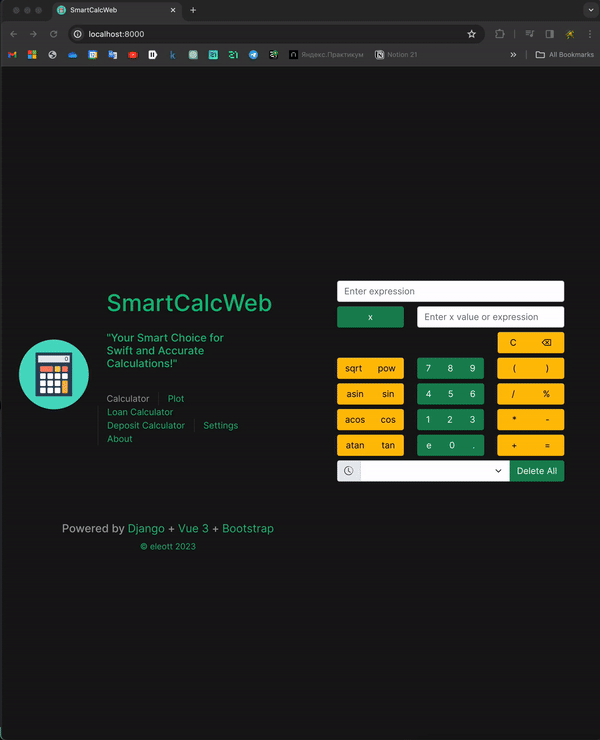
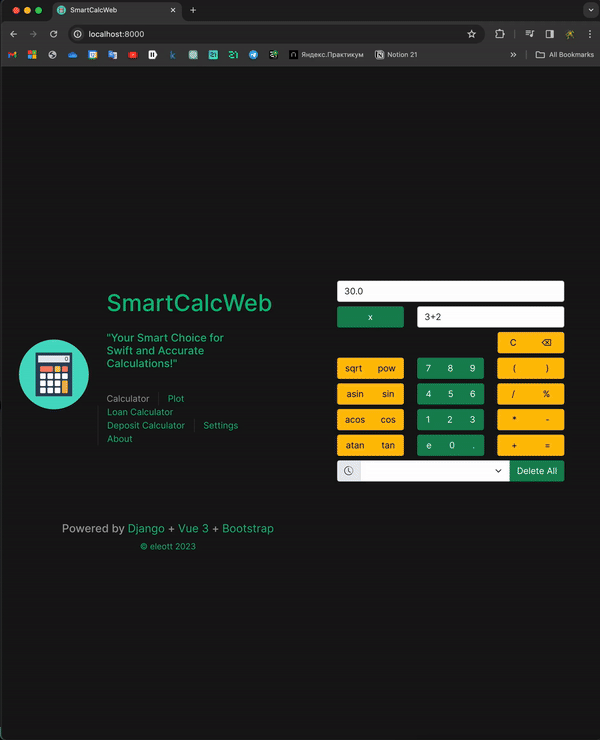
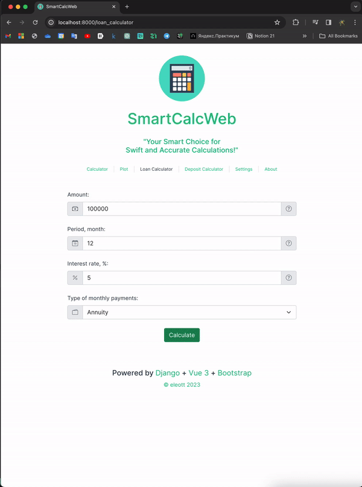
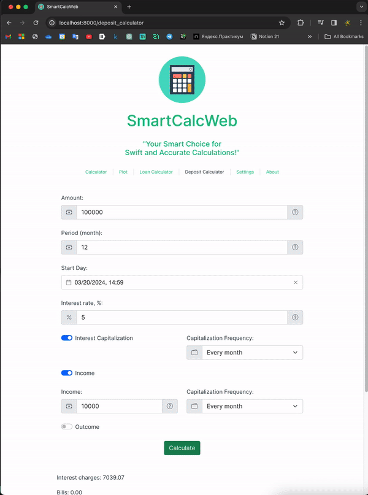

# SmartCalc v4.0

SmartCalc v4.0 is a Python-based web application designed to provide advanced mathematical calculations and financial tools. It incorporates features such as graph plotting, credit calculation, deposit calculation, configuration settings, and logging capabilities.

## Stack Usage

- Python 3.11
- MVC framework (Django or Flask)
- Server-Side Rendering
- Docker Compose
- JavaScript (for graph plotting)

## Build Instructions

1. Clone the repository to your local machine:

```
git clone <repository_url>
```

2. Navigate to the project directory:

```
cd <project_directory>
```

3. Spin up Docker instances
```
docker-compose up
```

## Description
SmartCalc v4.0 implements various mathematical and financial functionalities, adhering to MVC architecture and Google Code Style guidelines. It provides a user-friendly interface for performing complex calculations and analyzing financial scenarios.

## Features
### 1: Implementation of SmartCalc v4.0
Developed in Python 3.11
MVC framework (Django)
Reuses model from SmartCalc v3.0 written in C++
Help section with program interface description
History of operations with load and clear options
Support for arithmetic expressions and mathematical functions
Graph plotting functionality




### 2: Credit Calculator
Calculates monthly payment, overpayment, and total payment
Input: total loan amount, term, interest rate, and type (annuity or differentiated)

### 3: Deposit Calculator
Calculates accrued interest, tax amount, and final deposit amount
Input: deposit amount, term, interest rate, tax rate, payment frequency, interest capitalization, deposits list, withdrawals list



### 4: Configuration and Logging
Reads settings from a configuration file
Supports logging of operations history with rotation period customization


